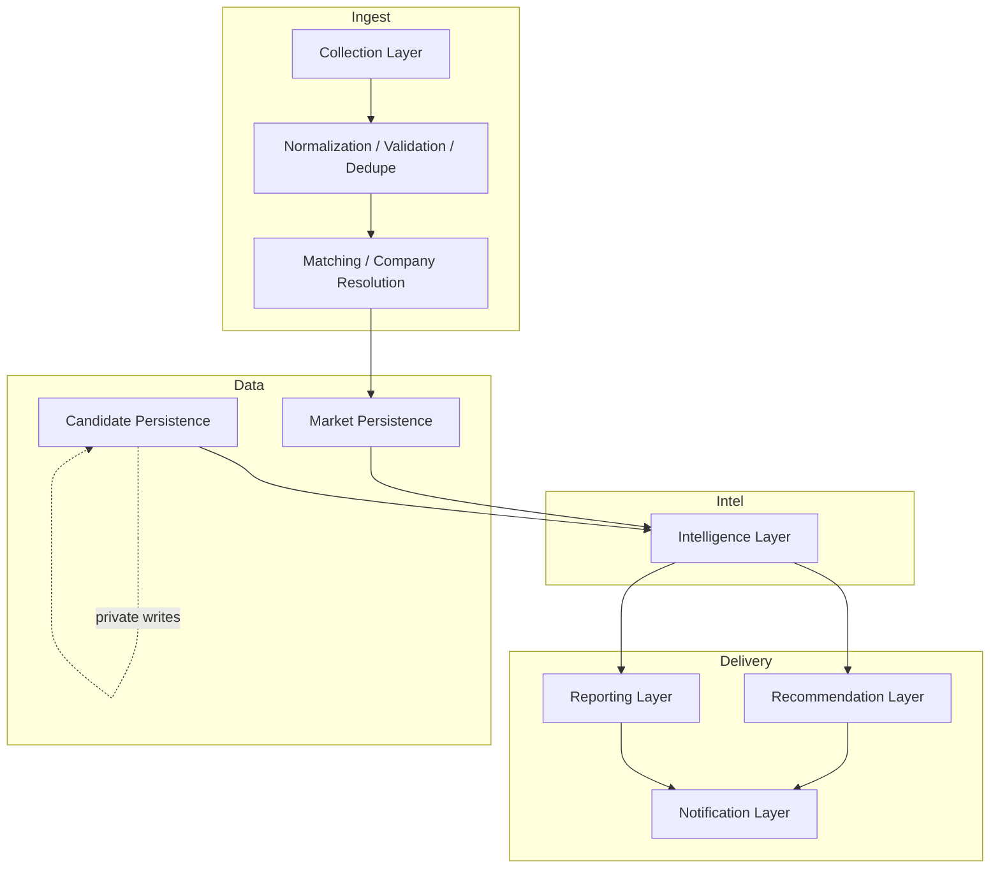
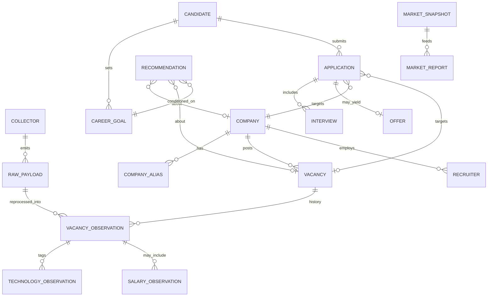
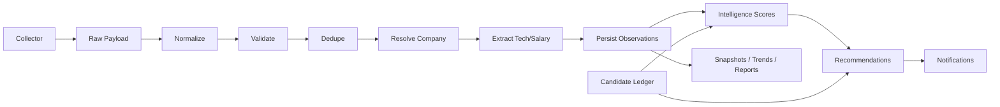
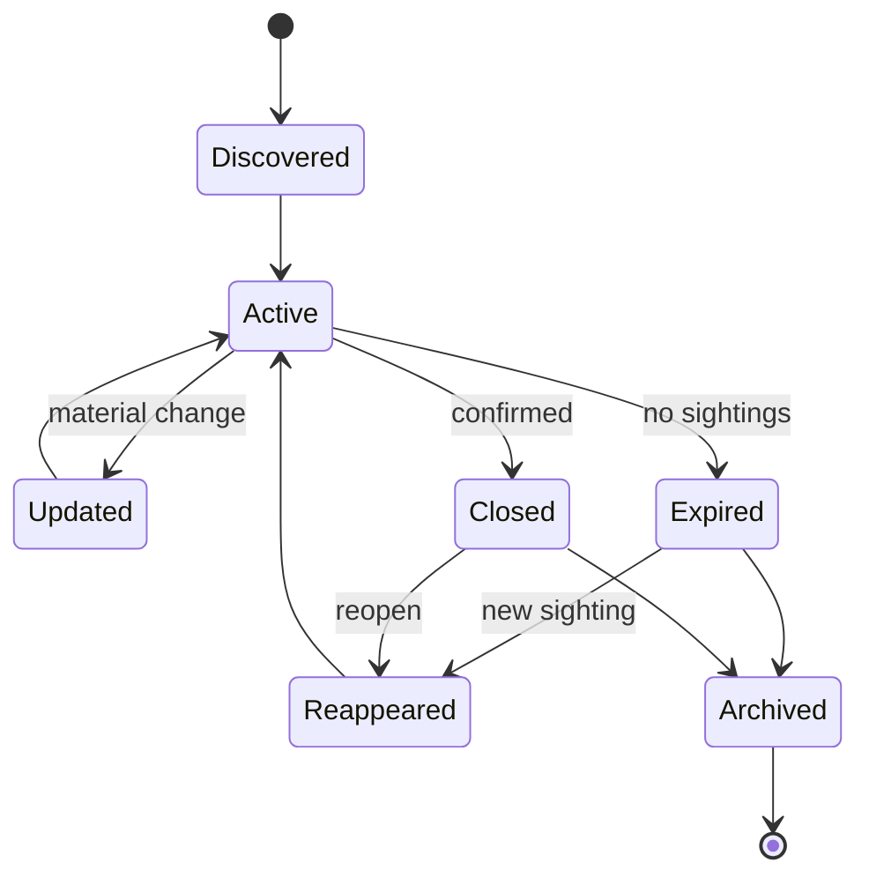
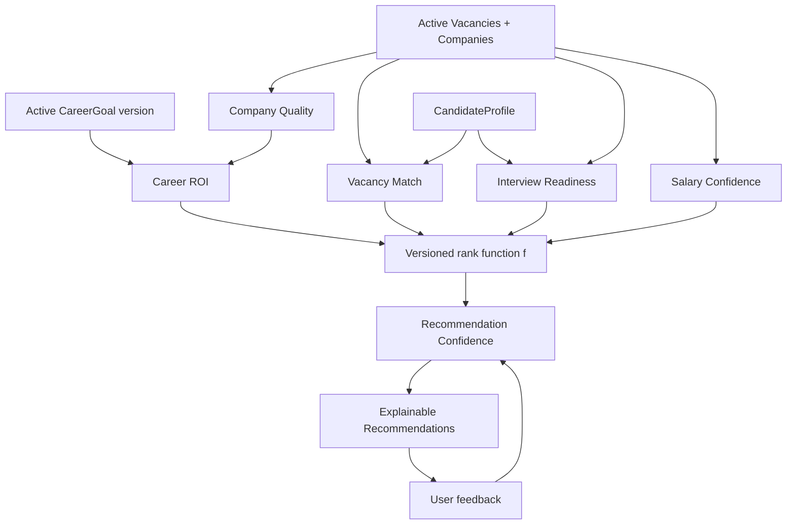

# RFC-0001 — Career Intelligence Platform Architecture

| Field | Value |
|-------|-------|
| **Status** | Draft |
| **Author** | Architecture audit synthesis (iOS Hunter → Career Intelligence) |
| **Created** | 2026-07-13 |
| **Horizon** | 3–5 years |
| **Type** | Architectural foundation |
| **Implementation** | Out of scope for this RFC |

**This RFC does not authorize implementation.** It defines the target architecture so future work can be reviewed against a stable contract.

---

## Abstract

iOS Hunter today is a **vacancy collection and notification system**. Collectors are the product; companies, history, and career decisions are accidental.

This RFC defines a **Career Intelligence Platform**: a system whose primary outputs are **explainable decisions** (where to apply, what to learn, what salary to target, how competitive you are), with collection as a replaceable input pipeline.

The architecture separates three bounded domains:

1. **Market domain** — employers, vacancies, technologies, salaries, trends (shareable / anonymizable).
2. **Candidate domain** — profile, goals, applications, interviews, offers (private).
3. **Intelligence domain** — scores, recommendations, reports (derived, versioned, explainable).

Prefer **few durable aggregates + immutable observations** over a large entity zoo. Every entity below earns its place by enabling a concrete decision.

---

## Decisions Enabled (acceptance test for this RFC)

If the architecture is correct, the platform can answer without rewriting collectors:

| Question | Answered by |
|----------|-------------|
| Which companies should I apply to? | Recommendation Engine + Career ROI + Candidate goals |
| Which skills should I learn next? | Technology Momentum × Candidate skill gap |
| How is the market changing? | MarketSnapshot history + Company/Technology/Salary trends |
| How competitive am I? | Interview Readiness + Vacancy Match distribution |
| What salary should I target? | SalaryObservation + Salary Confidence + goals |
| Which employers are becoming more attractive? | CompanyTrend + Career ROI delta |
| Which technologies are growing? | TechnologyTrend |
| What is my interview ROI? | Application/Interview/Offer outcomes ÷ effort |

---

# Section 1 — Vision

## 1.1 Current State

- Hourly collection from company career pages / ATS adapters.
- Ephemeral vacancy payloads; durable state is essentially “URL already notified.”
- Companies exist as scraper string labels, not aggregates.
- Notification is the product; intelligence is absent by design.
- Priorities optimize **collector coverage and freshness**, not **career outcomes**.

## 1.2 Future State

- Collection is one of many interchangeable sensors.
- **Company** and **Vacancy observations** are first-class, historically preserved.
- **Candidate** data lives in a separate private store with explicit boundaries.
- Multiple **named, versioned scores** feed an **explainable recommendation engine**.
- Humans receive ranked, justified actions (apply / learn / wait / ignore), not raw URL dumps.
- Analytics accumulate daily → weekly → monthly → quarterly → yearly without recomputing from scratch alone.

## 1.3 Mission

Turn fragmented hiring signals into a **personal decision-support system** for Senior iOS (and later adjacent) career moves—optimized for long-term ROI, not vacancy volume.

## 1.4 Target Users

| User | Role |
|------|------|
| **Primary** | The candidate-operator (single-player): applies, interviews, learns |
| **Secondary** | Future self reviewing yearly trends and calibrating scores |
| **Non-user (initially)** | Recruiters, teams, multi-tenant SaaS customers |

Multi-tenant productization is explicitly deferred. Architecture must not prevent it later, but must not pay for it now.

## 1.5 Core Capabilities

1. Ingest market signals from independent collectors.
2. Resolve employers to a canonical company registry.
3. Preserve vacancy and salary/technology observations over years.
4. Maintain a private candidate career ledger.
5. Compute separated, explainable intelligence scores.
6. Emit ranked recommendations with evidence.
7. Produce scheduled market and personal reports.
8. Observe pipeline health and recommendation precision.

## 1.6 Success Metrics

| Metric | Intent |
|--------|--------|
| **Recommendation precision** | % of notified/recommended items that are acted on or marked relevant |
| **False-positive rate** | QA/TPM/noise / wrong seniority in top recommendations |
| **Decision latency** | Time from vacancy observation → ranked recommendation |
| **History depth** | Continuous observation days (target: unbroken ≥365) |
| **Score explainability** | Every recommendation exposes top contributing factors |
| **Collector independence** | New ATS added without changing intelligence contracts |
| **Interview ROI** | Offers (or late-stage interviews) per focused prep hour / application |
| **Goal alignment** | Share of recommendations matching active CareerGoals |

Vanity metrics (total vacancies scraped, number of collectors) are **not** success metrics.

## 1.7 Non-Goals (product / RFC)

- Designing UI, mobile apps, or dashboards as products.
- Generating production code, migrations, or framework choices.
- Optimizing for the current repository file layout.
- Building a multi-user recruiting SaaS in Phases 1–3.
- Auto-applying to jobs or generating mass outreach.
- Guaranteeing salary or offer predictions as truth (confidence-bounded estimates only).

---

# Section 2 — Architecture Principles

### P1 — Single Source of Truth

Each fact has one authoritative owner aggregate. Collectors never own company identity. Recommendations never own vacancy facts. Candidate outcomes never rewrite market history.

### P2 — Immutable History

Observations are append-only. Corrections create new versions or compensating events; they do not silently rewrite the past. Trends must be reproducible from stored observations + algorithm version.

### P3 — Collector Independence

Collectors produce **RawCollectorPayload** only. They must not call intelligence, recommendations, or candidate stores. Swapping a collector must not change scoring contracts.

### P4 — Explainable Intelligence

Every score and recommendation declares: algorithm id, version, inputs used, top drivers, confidence. Opaque “AI scores” without evidence are out of policy.

### P5 — Incremental Evolution

Each roadmap phase ships user value alone. No big-bang rewrite required. Old notifier mode can remain a thin consumer of recommendations.

### P6 — Data Before Features

Do not ship trend dashboards, predictive models, or fancy reports before observation retention and company resolution quality meet thresholds.

### P7 — Composition Over Coupling

Intelligence modules compose via shared read models / events, not by reaching into collector internals or each other’s mutable state.

### P8 — Deterministic Processing

Given the same payloads, registry, candidate snapshot, and algorithm versions, outputs are reproducible. Non-determinism (LLMs) is confined to optional extraction aids with stored provenance—not to final score authority without human-auditable features.

### P9 — Offline Analytics

Batch analytics (daily/weekly/monthly) are first-class. Real-time is limited to ingest + notify. Heavy joins belong offline.

### P10 — Simple Systems First

Prefer one observation log + company registry + candidate ledger over microservices. Add complexity only when a principle is violated or a metric stalls.

### P11 — Explicit Ownership

Every entity has an owner domain (Market / Candidate / Intelligence / Platform). Cross-domain writes are forbidden; cross-domain reads are explicit.

### P12 — Long-lived Data Models

Schema evolves by additive fields and versioned derived artifacts. Breaking changes require migration plans and dual-read windows. Names outlive scrapers.

---

# Section 3 — Domain Model

Entities are grouped by domain. **Justifications** note why each exists (or why a temptation was rejected).

**Rejected as first-class (initially):** separate “ATS Account”, “Career Page”, “Skill” graph nodes as roots—model them as value objects on Company / TechnologyObservation until cardinality forces promotion.

---

## 3.1 Market Domain

### Collector

| | |
|--|--|
| **Purpose** | Named sensor that fetches employer/board signals |
| **Responsibilities** | Fetch; emit RawCollectorPayload; report health |
| **Owner** | Collection Layer |
| **Lifecycle** | Registered → enabled/disabled → retired |
| **Relationships** | Produces many RawCollectorPayload; references zero or more Companies as *hints* only |
| **Persistence** | Registry metadata (id, kind, schedule, enabled) |
| **Mutable** | enabled, schedule, reliability notes |
| **Immutable** | collector_id, kind |
| **Derived** | success rate, lag, empty-streak |

### RawCollectorPayload

| | |
|--|--|
| **Purpose** | Immutable bytes/structured blob as received |
| **Responsibilities** | Preserve provenance for reprocessing |
| **Owner** | Collection Layer |
| **Lifecycle** | Created once; retained per retention policy; never edited |
| **Relationships** | 1 Collector; 0..N Normalized vacancies after processing |
| **Persistence** | Append-only object/log store |
| **Mutable** | none |
| **Immutable** | payload_id, collector_id, fetched_at, content, content_hash |
| **Derived** | parse status |

**Why:** Website HTML changes; re-running normalization against raw history is the only honest recovery path.

### Vacancy

| | |
|--|--|
| **Purpose** | Canonical open-role identity as understood by the platform |
| **Responsibilities** | Stable identity across URL mutations when resolvable; hold current projection |
| **Owner** | Market domain |
| **Lifecycle** | Discovered → updated → expired/closed → archived; may reappear |
| **Relationships** | Belongs to Company; has many VacancyObservations; may link Notifications |
| **Persistence** | Current projection + observation log |
| **Mutable** | current_title, current_url, status, last_observed_at |
| **Immutable** | vacancy_id (once assigned) |
| **Derived** | seniority, role_family, tech_tags, days_open |

**Note:** Prefer **VacancyObservation** as the historical atom; Vacancy is the fold of observations.

**VacancyObservation** (required supporting concept): immutable sighting `{vacancy_id?, company_id, url, title, description, location, remote, published_at, observed_at, source, payload_ref}`.

### Company

| | |
|--|--|
| **Purpose** | First-class employer aggregate |
| **Responsibilities** | Identity, profile, policies, links to vacancies/recruiters/trends |
| **Owner** | Market domain (Company Registry) |
| **Lifecycle** | Provisional → verified → merged/deprecated |
| **Relationships** | Aliases; Vacancies; Recruiters; ATS endpoints; Trends |
| **Persistence** | Registry store |
| **Mutable** | profile fields, policies, enabled_for_collection |
| **Immutable** | company_id |
| **Derived** | career_roi, quality scores, hiring velocity (versioned) |

### CompanyAlias

| | |
|--|--|
| **Purpose** | Map string labels / legal names / board slugs → company_id |
| **Responsibilities** | Prevent N-iX ↔ NIX class errors |
| **Owner** | Company Registry |
| **Lifecycle** | Active → retired (keep for history) |
| **Relationships** | Many aliases → one Company |
| **Persistence** | Registry |
| **Mutable** | confidence, retired_at |
| **Immutable** | alias string once attached (retire instead of edit) |
| **Derived** | none |

### Recruiter

| | |
|--|--|
| **Purpose** | Human contact point at a company/channel |
| **Responsibilities** | Identity for outreach memory (market-facing, non-secret attributes) |
| **Owner** | Market domain (public attributes) / Candidate domain (private notes) |
| **Lifecycle** | Observed → active → stale |
| **Relationships** | Company; optional Application touches |
| **Persistence** | Split: public vs private notes |
| **Mutable** | channel handles (with care), active flag |
| **Immutable** | recruiter_id |
| **Derived** | response stats **only from Candidate Application events** |

**Why split:** Response rates are personal outcomes, not market facts about the recruiter’s soul.

### SalaryObservation

| | |
|--|--|
| **Purpose** | Evidence of compensation signal |
| **Responsibilities** | Store stated range/point, currency, seniority, source, confidence |
| **Owner** | Market domain |
| **Lifecycle** | Append-only |
| **Relationships** | Optional Company, Vacancy, region |
| **Persistence** | Observation log |
| **Mutable** | none |
| **Immutable** | all fields + observed_at |
| **Derived** | normalized monthly USD estimate (algorithm-versioned) |

### TechnologyObservation

| | |
|--|--|
| **Purpose** | Evidence that a technology appeared in a vacancy (or company profile) |
| **Responsibilities** | Tag extraction provenance |
| **Owner** | Market domain |
| **Lifecycle** | Append-only |
| **Relationships** | VacancyObservation / Company |
| **Persistence** | Observation log |
| **Mutable** | none |
| **Immutable** | tech_id, strength, source_span, observed_at |
| **Derived** | none (aggregation → TechnologyTrend) |

### MarketSnapshot

| | |
|--|--|
| **Purpose** | Point-in-time fold of market state for reporting |
| **Responsibilities** | Freeze counts, top employers, open vacancy set hash |
| **Owner** | Intelligence / Reporting |
| **Lifecycle** | Produced on schedule; immutable thereafter |
| **Relationships** | References observation watermarks |
| **Persistence** | Snapshot store |
| **Mutable** | none |
| **Immutable** | snapshot_id, period, metrics blob, algo_versions |
| **Derived** | comparisons vs previous snapshot |

### TechnologyTrend / CompanyTrend / SalaryTrend

| | |
|--|--|
| **Purpose** | Derived time-series products |
| **Responsibilities** | Answer “growing / declining / stable” with method + window |
| **Owner** | Intelligence Layer |
| **Lifecycle** | Recomputed; prior runs retained by version |
| **Relationships** | Built from observations + snapshots |
| **Persistence** | Derived store |
| **Mutable** | none (replace by new run) |
| **Immutable** | run_id, window, method_version |
| **Derived** | slope, momentum class, confidence |

### MarketReport

| | |
|--|--|
| **Purpose** | Human-readable scheduled artifact |
| **Responsibilities** | Narrative + tables for a period |
| **Owner** | Reporting Layer |
| **Lifecycle** | Generated → published → archived |
| **Relationships** | Snapshots, trends, recommendations summary |
| **Persistence** | Document store |
| **Mutable** | none after publish (corrigendum = new report) |
| **Immutable** | report_id, period |
| **Derived** | none |

---

## 3.2 Candidate Domain (private)

### CandidateProfile

| | |
|--|--|
| **Purpose** | Who the candidate is (skills, seniority, languages, constraints) |
| **Responsibilities** | Source for matching; never written by market pipeline |
| **Owner** | Candidate domain |
| **Lifecycle** | Continuous manual/assisted updates |
| **Relationships** | Goals; Applications; skill progress |
| **Persistence** | Private store |
| **Mutable** | skills, seniority claims, English level, location |
| **Immutable** | candidate_id |
| **Derived** | readiness scores (via Intelligence, stored as derived) |

### CareerGoal

| | |
|--|--|
| **Purpose** | Explicit targets (salary band, relo window, company tiers, AI focus) |
| **Responsibilities** | Parameterize Career ROI and recommendations |
| **Owner** | Candidate domain |
| **Lifecycle** | Active goal sets with effective dates |
| **Relationships** | CandidateProfile |
| **Persistence** | Private store |
| **Mutable** | targets while draft; freeze version when “active” |
| **Immutable** | goal_set_id once activated |
| **Derived** | none |

### Application

| | |
|--|--|
| **Purpose** | Candidate action toward a vacancy/company |
| **Responsibilities** | Track funnel stage, channel, effort |
| **Owner** | Candidate domain |
| **Lifecycle** | Started → in process → terminal (reject/withdraw/offer/ghosted) |
| **Relationships** | Company; optional Vacancy; Interviews; Offer |
| **Persistence** | Private ledger |
| **Mutable** | stage, notes |
| **Immutable** | application_id, started_at |
| **Derived** | time_in_stage, interview_roi contribution |

### Interview

| | |
|--|--|
| **Purpose** | Recorded interview event |
| **Responsibilities** | Stages, format, feedback, self-assessment (labeled separately) |
| **Owner** | Candidate domain |
| **Lifecycle** | Scheduled → completed → documented |
| **Relationships** | Application |
| **Persistence** | Private ledger |
| **Mutable** | notes until locked |
| **Immutable** | interview_id; employer_feedback once locked |
| **Derived** | difficulty tags |

### Offer

| | |
|--|--|
| **Purpose** | Compensation/outcome artifact |
| **Responsibilities** | Ground-truth for salary model calibration |
| **Owner** | Candidate domain |
| **Lifecycle** | Extended → accepted/declined/expired |
| **Relationships** | Application |
| **Persistence** | Private ledger (high sensitivity) |
| **Mutable** | status |
| **Immutable** | amounts as recorded (corrections = new revision) |
| **Derived** | normalized monthly USD |

**PreferredCompanies / IgnoredCompanies:** model as CandidateProfile lists or tags—not separate roots unless cardinality explodes.

**SkillProgress:** append-only private observations `{skill, level, evidence, at}` feeding Interview Readiness.

---

## 3.3 Intelligence & Delivery Domain

### Recommendation

| | |
|--|--|
| **Purpose** | Explainable suggested action |
| **Responsibilities** | Ranked item + reasons + confidence + expiry |
| **Owner** | Recommendation Layer |
| **Lifecycle** | Generated → delivered → acted/dismissed/expired |
| **Relationships** | Company and/or Vacancy; CareerGoal version; score run ids |
| **Persistence** | Derived + feedback log |
| **Mutable** | user_feedback |
| **Immutable** | recommendation_id, generated_at, explanation, algo_version |
| **Derived** | outcome attribution (later) |

### Notification

| | |
|--|--|
| **Purpose** | Delivery vehicle (message channel) |
| **Responsibilities** | Transport recommendations or pipeline health |
| **Owner** | Notification Layer |
| **Lifecycle** | Queued → sent → failed/acked |
| **Relationships** | 0..N Recommendations; optional raw vacancy refs for debug |
| **Persistence** | Delivery log |
| **Mutable** | delivery status |
| **Immutable** | notification_id, channel, created_at |
| **Derived** | open/click if available |

---

# Section 4 — Layered Architecture

```text
┌─────────────────────────────────────────┐
│           Notification Layer            │
├─────────────────────────────────────────┤
│     Reporting Layer  │  Recommendation  │
├─────────────────────────────────────────┤
│           Intelligence Layer            │
├─────────────────────────────────────────┤
│     Persistence Layer (Market+Derived)  │  ←──  Candidate Persistence (private)
├─────────────────────────────────────────┤
│ Matching / Resolution (company, vacancy)│
├─────────────────────────────────────────┤
│     Normalization + Validation Layer    │
├─────────────────────────────────────────┤
│           Collection Layer              │
└─────────────────────────────────────────┘
```

### Allowed dependencies (↓ only)

| Layer | May depend on |
|-------|----------------|
| Collection | External sites/APIs only |
| Normalization | Raw payloads, shared vocabularies |
| Matching/Resolution | Normalized records, Company Registry |
| Persistence | Normalized + resolved entities |
| Intelligence | Persistence **reads**; algorithm configs |
| Recommendation | Intelligence outputs + Candidate **reads** |
| Reporting | Snapshots, trends, recommendations |
| Notification | Recommendation/Reporting outputs |

### Forbidden dependencies

- Collection → Intelligence / Candidate / Recommendation
- Intelligence → Notification side effects
- Market Persistence ← Candidate writes
- Recommendation → Collector internals
- UI (future) → bypassing Recommendation contracts to scrape stores ad hoc

Candidate Persistence is **side-by-side**, not below Market: Intelligence/Recommendation may **read** both; only Candidate tools **write** candidate data.

---

# Section 5 — End-to-End Data Flow

```text
Collector
  → RawCollectorPayload (persist immediately)
  → Normalization (structured vacancy candidates)
  → Validation (schema + policy: language, required fields)
  → Deduplication (identity keys, richness rules)
  → Company Resolution (aliases → company_id; quarantine unknowns)
  → Technology Extraction (tags + provenance)
  → Salary Extraction (optional; low confidence OK)
  → Persistence (VacancyObservation + projections)
  → Career Intelligence (batch or near-line score refresh)
  → Recommendation Engine (goal-conditioned ranking)
  → Notifications (ranked actions)
  → Analytics (snapshots, trends, precision metrics)
```

### Stage notes

| Stage | Responsibility | Failure mode |
|-------|----------------|--------------|
| Collector | Best-effort fetch | Mark unhealthy; do not invent jobs |
| Raw persist | Durability before parse | Disk/object errors halt batch |
| Normalization | Map heterogeneous ATS/HTML → common shape | Quarantine poison payloads |
| Validation | Drop/flag non-iOS-eng if policy says so | Prefer quarantine over silent drop for audit |
| Deduplication | One logical role per identity | Log collapse groups |
| Company Resolution | Bind to registry | Unresolved → provisional company or holding tank |
| Tech/Salary extract | Feature enrichment | Empty description → explicit “unknown”, not guesses presented as fact |
| Persistence | Append observations; update projection | Idempotent by observation hash |
| Intelligence | Recompute derived scores by version | Never mutate observations |
| Recommendation | Produce explainable actions | Empty set OK; send health digest |
| Notification | Deliver | Retry independently; don’t re-ingest |
| Analytics | Offline folds | Run on schedule; watermarked |

---

# Section 6 — Storage Strategy

### Persisted

- RawCollectorPayload (ttl-bounded)
- Company registry + aliases
- Vacancy observations + current vacancy projection
- Salary/Technology observations
- Market snapshots & trend runs
- Recommendations + feedback
- Notification delivery log
- Candidate ledger (separate encryption/access boundary)
- Algorithm version manifests

### Ephemeral

- In-memory scrape DOM
- Transient HTTP caches
- Working sets for a single batch job

### Retention policy (default proposal)

| Data | Retention |
|------|-----------|
| Raw payloads | 90–180 days (reprocess window) |
| Vacancy observations | ≥ 5 years (career platform horizon) |
| Snapshots/trends/reports | ≥ 5 years |
| Candidate offers/interviews | Indefinite (owner-controlled) |
| Delivery logs | 1–2 years |

Exact numbers are an **open question**; architecture requires *policy exists*, not these constants.

### Snapshot strategy

- Daily MarketSnapshot watermarked to observation log offset.
- Weekly/Monthly reports materialize from snapshots + trend runs—not by full replay alone (replay remains available for audits).

### Versioning

- Entities: additive fields.
- Algorithms: `algo_id@version`; outputs cite versions.
- Registry merges: surviving company_id + deprecated ids map.

### Historical corrections

- Wrong company resolution: alias fix + **re-resolution job** producing new observations/projections; keep old observations with deprecated binding markers.
- Never delete evidence of a past recommendation delivery.

### Backup philosophy

- Market data: standard backup + periodic export.
- Candidate data: separate backup keys; restore drills; treat as personal data.

---

# Section 7 — Company Registry

Company is the **hub aggregate** for market intelligence.

### Identity

- Surrogate `company_id` (stable).
- External keys: ATS board slugs, career hostnames, DOU slugs—via aliases, not as primary key.

### Core profile groups

| Group | Examples |
|-------|----------|
| Aliases | Legal names, brand names, board slugs |
| ATS / Career pages | Greenhouse slug, Ashby org, custom careers URL |
| Locations | HQ, hubs, hiring regions |
| Domains | product domains, industries |
| Remote policy | office / hybrid / remote-UA / remote-world |
| Relocation | none / EU / US / case-by-case |
| Engineering profile | craft reputation band, interview bar (qualitative, sourced) |
| Product profile | product / services / mixed |
| Technology profile | derived from TechnologyObservations |
| Historical metrics | vacancy counts by window, open/close rates |
| Derived metrics | Company Quality, Career ROI, momentum |
| Relationships | parent holding, acquired-by, spun-out (optional graph) |

### Governance

- Provisional companies auto-created from unresolved strings with low trust.
- Human verification promotes to verified.
- Merges are first-class operations with audit trail.

---

# Section 8 — Vacancy Lifecycle

| State | Meaning |
|-------|---------|
| **Discovered** | First observation |
| **Updated** | Material field change (title/desc/location) |
| **Deduplicated** | Collapsed into existing vacancy_id |
| **Active** | Believed open |
| **Expired** | TTL without sighting (policy) |
| **Closed** | Explicit close signal or confirmed gone |
| **Reappeared** | New observation after closed/expired → new lifecycle segment or reopen event |
| **Archived** | Cold storage; still queryable for history |

**Historical preservation:** observations remain queryable after closure. “Delete vacancy” is not a market operation—only candidate may hide items from *their* UI preferences.

**Reappearance policy:** same ATS job id → reopen same vacancy_id; new id/URL with same company+title → similarity match with confidence; low confidence → new vacancy_id linked as “possible duplicate.”

---

# Section 9 — Candidate Intelligence

### Why separate from market data

| Reason | Detail |
|--------|--------|
| **Sensitivity** | Offers, feedback, recruiter chats are personal |
| **Bias** | Personal outcomes must not silently rewrite market salary distributions without labeling |
| **Ownership** | Market can be published/anonymized; candidate cannot |
| **Failure isolation** | Leak of market DB ≠ leak of career diary |
| **Truth types** | Market = observations about employers; Candidate = actions/outcomes of one person |

### Personal domain contents

- CandidateProfile, CareerGoal sets  
- Preferred / Ignored companies  
- Applications, Interviews, Offers  
- SkillProgress  
- Private recruiter notes  
- Feedback on Recommendations (relevant / irrelevant / applied)

### Interface to market/intelligence

- **Reads:** candidate goals + profile features into Recommendation/Matching.
- **Writes:** only Candidate tools.
- **Calibration:** Offer/Interview outcomes export **anonymized features** into salary/interview models as labeled personal calibration set—not as global ground truth without consent flags.

---

# Section 10 — Intelligence Engine

**Rule: do not combine unrelated scores into one cryptic number without a named composition function.**

| Score | Purpose | Inputs | Outputs | Consumers |
|-------|---------|--------|---------|-----------|
| **Collector Priority** | How often/urgently to fetch | failure rate, tier of companies covered, cost | schedule weight | Collection scheduler |
| **Source Reliability** | Trust of a collector/ATS | parse failures, empty streaks, schema breaks | reliability 0–1 | Validation, ops |
| **Company Quality** | Engineering/product quality independent of *you* | registry profile, tech observations, external research flags | 0–100 + drivers | Reports, ROI |
| **Career ROI** | Fit to *active CareerGoals* | Company Quality, salary model, remote/relo, AI, goals version | 0–100 + drivers | Recommendations |
| **Vacancy Match** | Fit of one vacancy to CandidateProfile | title/seniority/tech/remote vs profile | 0–100 + drivers | Recommendations |
| **Interview Readiness** | Likelihood *you* clear this bar *now* | skill progress, recent interview outcomes, vacancy bar signals | 0–100 + gaps | Personal strategy |
| **Salary Confidence** | Trust in compensation estimate | observation count, recency, transparency | confidence band | Salary advice |
| **Technology Momentum** | Growth/decline of a tech | TechnologyObservations windows | momentum + confidence | Learning recommendations |
| **Market Confidence** | Trust in market-wide claims | history depth, coverage bias, collector health | confidence | Reports (suppress weak claims) |
| **Recommendation Confidence** | Trust in a single action | min of underlying confidences + data completeness | confidence | Notification gating |

Composition example (explicit):

```text
rank_score = f(
  Career ROI(company),
  Vacancy Match(vacancy, profile),
  Interview Readiness(profile, vacancy),
  Recommendation Confidence
)
```

`f` is versioned and documented—not hidden inside collector tiers.

**Challenge to prior audits:** Scraper `JobSourceTier` must map only to **Collector Priority**, never to Career ROI.

---

# Section 11 — Historical Intelligence

| Cadence | Artifact | Content |
|---------|----------|---------|
| Daily | MarketSnapshot + observation watermark | Open counts, new/closed, collector health |
| Weekly | Short digest | Top recommendations, noise rate, new Tier S/A vacancies |
| Monthly | MarketReport | Hiring velocity, tech momentum, salary bands, company movers |
| Quarterly | Strategy report | Goal progress, interview ROI, score calibration notes |
| Yearly | Annual review | Multi-year tech/salary/company evolution; candidate evolution |

### Evolution tracks

- **Technology evolution** — momentum tables, enter/exit from top-N tags  
- **Salary evolution** — band drift by seniority/segment  
- **Hiring evolution** — vacancy volume and seniority mix  
- **Company evolution** — ROI and quality deltas; alias/M&A events  
- **Candidate evolution** — skill progress, offer outcomes, readiness

Cold-start rule: suppress trend language until Market Confidence threshold is met (e.g. ≥90 days continuous observations)—exact threshold open.

---

# Section 12 — Recommendation Engine

### Recommendation object (minimum)

- `action`: apply | watch | learn | ignore | prepare_interview  
- `subject`: company and/or vacancy and/or skill  
- `rank`  
- `explanation[]`: human-readable drivers with score citations  
- `confidence`  
- `goal_set_id`  
- `algo_version`  
- `expires_at`

### Scoring dimensions for career actions

| Dimension | Role |
|-----------|------|
| Career fit | Career ROI × Vacancy Match |
| Market demand | Local momentum for role/tech |
| Learning value | Tech gap × Technology Momentum |
| Interview probability | Interview Readiness × historical funnel (personal) |
| Salary probability | P(comp ∈ goal band) × Salary Confidence |
| Long-term ROI | Brand + relo + skill compounding (explicit weights) |

### Explainability contract

A recommendation is invalid if it cannot list ≥1 factual market input and ≥1 goal/profile input (unless action is purely operational, e.g. “collector X down”).

### Feedback loop

User marks relevant/irrelevant/applied → trains **Recommendation Confidence** and filter weights; does not silently rewrite Company Quality.

---

# Section 13 — Observability

| Metric | Why |
|--------|-----|
| Pipeline latency (fetch→persist→recommend) | Freshness SLA |
| Collector health (success, empty, error) | Source Reliability |
| Deduplication rate | Identity quality / over-collapse risk |
| Normalization failures | Schema drift |
| Company resolution quality (% verified, % provisional) | Hub integrity |
| Notification precision (feedback) | Product quality |
| False positives / false negatives | Filter tuning |
| Data freshness (max observation lag) | Trust |
| Market Confidence | Gate on trend claims |
| Recommendation dismiss rate | Ranker quality |

Alert on: collector failure streaks, resolution collapse (too many provisionals), precision cliffs after algorithm changes.

---

# Section 14 — Extensibility

| Extension | How (without modifying existing components) |
|-----------|-----------------------------------------------|
| New collector | Implement Collector contract → emit RawCollectorPayload; register metadata |
| New ATS | New collector + normalization mapping; registry ATS fields updated |
| New recommendation type | New producer subscribed to intelligence read models; new `action` enum value |
| New scoring algorithm | Register `algo_id@version`; dual-run compare; switch consumer pointer |
| New report | New Reporting job reading snapshots/trends |
| New dashboard | Read-only consumer of Reporting/Recommendation APIs |

**Extension rule:** existing collectors/intelligence modules remain untouched if contracts are stable; adapters live at edges.

---

# Section 15 — Risks

| Risk | Impact | Mitigation |
|------|--------|------------|
| Missing descriptions | No tech/salary features | Persist raw; improve extractors; mark unknown; don’t fake trends |
| Company aliases | Wrong ROI / merged rivals (NIX vs N-iX) | Alias governance; provisional quarantine; human verify Tier S/A |
| Salary estimation | Harmful advice | Salary Confidence gating; separate observation vs estimate |
| Website/ATS changes | Collector breakage | Raw replay; Source Reliability; diverse collectors |
| Collector failures | Blind spots | Health digests; multi-source per Tier S company |
| Data drift | Stale scores | Scheduled recompute; version pins in reports |
| Bias | Overfit outsourcing HTML; underweight Djinni/intl | Coverage metrics by segment; explicit bias report |
| Cold start | Empty history | Phase 1 value = hygiene + registry + ranked notify; delay trends |
| Candidate/market mix | Privacy + polluted stats | Hard boundary; separate stores/keys |
| Over-entity modeling | Unmaintainable platform | Start with observations + company + candidate ledger; promote entities only under pressure |

---

# Section 16 — Roadmap

Each phase delivers standalone user value.

### Phase 1 — Foundation

**User value:** Higher-signal alerts; companies as real entities; no fake trends.

- Company registry + aliases  
- VacancyObservation persistence  
- Title/role_family hygiene  
- Split Collector Priority vs Career ROI (even if ROI is manually seeded)  
- Ranked notifications with explanations  
- Pipeline observability basics  

### Phase 2 — Market Intelligence

**User value:** “What’s changing?” becomes answerable.

- Tech + salary extraction  
- Daily snapshots; weekly/monthly reports  
- Company/Technology/Salary trends gated by Market Confidence  
- Source reliability automation  
- Expanded Tier S/A collectors  

### Phase 3 — Candidate Intelligence

**User value:** Personal ROI and readiness.

- Private candidate ledger (applications/interviews/offers)  
- CareerGoals versioning  
- Vacancy Match + Interview Readiness  
- Recommendation feedback loop  
- Interview ROI reports  

### Phase 4 — Predictive Intelligence

**User value:** Forward-looking guidance with honesty about uncertainty.

- Calibrated salary probability  
- Interview success models (personal + anonymized features)  
- Employer attractiveness forecasting  
- Learning-path recommendations from Technology Momentum × gaps  
- Still explainable; still confidence-gated  

---

# Section 17 — Trade-offs

| Trade-off | Choice | Rationale |
|-----------|--------|-----------|
| Raw vs normalized only | **Both** (raw ttl + normalized forever) | Replay vs query cost |
| Mutable vs immutable history | **Immutable observations + mutable projections** | Auditability |
| Performance vs simplicity | **Simple monolith/batch first** | Single-operator scale |
| Precision vs maintainability | **Confidence + unknowns over false precision** | Trust |
| Generality vs cost | **Single-candidate architecture; market model reusable** | Avoid multi-tenant tax |
| Real-time ML vs batch | **Batch intelligence** | Determinism + cost |
| One mega-score vs many | **Many named scores + explicit composition** | Explainability |

---

# Section 18 — Open Questions

Do not invent answers here; resolve in follow-up RFCs or ADRs.

1. Exact retention TTLs for raw payloads vs observations?  
2. Vacancy identity when ATS job ids are missing—fingerprint algorithm?  
3. Thresholds for Market Confidence before publishing trends?  
4. Where does candidate private store physically live relative to market store?  
5. Are holdings (Genesis/SKELAR portfolio companies) separate Company nodes or tagged children?  
6. Policy for LLM-assisted extraction: allowed features vs forbidden final authority?  
7. Legal/ToS posture for board aggregators (e.g. Djinni-class sources)?  
8. Manual research fields on Company (quality ratings)—who curates and how often?  
9. Multi-currency / equity normalization method for offers?  
10. Should Notification remain channel-agnostic enough for non-Telegram delivery without a new RFC?  
11. Provisional company auto-merge aggressiveness vs human review SLA for Tier S?  
12. Compatibility period supporting legacy “URL seen store” alongside VacancyObservation?

---

# Section 19 — Diagrams

## 19.1 Layer Diagram



## 19.2 Entity Relationship (simplified)



## 19.3 Data Flow Diagram



## 19.4 Vacancy Lifecycle Diagram



## 19.5 Recommendation Pipeline



---

## Appendix A — Mapping from Current System (informative)

| Today | Future |
|-------|--------|
| `JobSource` / Python collectors | Collector |
| `swift_export.json` ephemeral jobs | Raw + Normalized + Observations |
| `company` string | Company + CompanyAlias |
| `JobSourceTier` | Collector Priority only |
| `seen.json` URL gate | Delivery dedupe ⊆ Notification log; **not** market history |
| Telegram message | Notification of Recommendations |
| Profile interview markdown | Candidate Application/Interview (import path) |
| Audit markdown reports | MarketReport / generated artifacts |

This appendix does not constrain implementation technology or force a big-bang migration.

---

## Appendix B — Minimal Viable Entity Set (challenge to complexity)

If staffing is constrained, implement **only**:

1. Company + CompanyAlias  
2. VacancyObservation (+ folded Vacancy)  
3. CandidateProfile + CareerGoal + Application  
4. Recommendation + Notification  
5. Named scores: Collector Priority, Career ROI, Vacancy Match  

Promote Recruiter, Offer, Trend entities when Phase 2–3 metrics demand them. **Do not block Phase 1 on the full catalog.**

---

## Appendix C — Revision History

| Date | Change |
|------|--------|
| 2026-07-13 | Initial draft RFC-0001 |

---

**End of RFC-0001**
